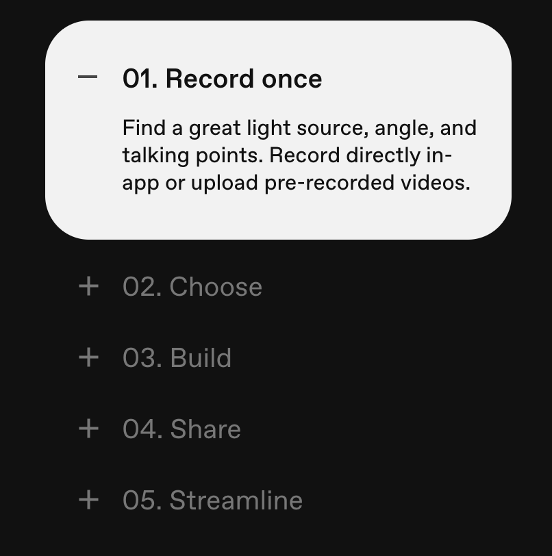

# Open Menu - Menú con Gestión de Estado y CSS en React

## Descripción

Open Menu es una sencilla aplicación en React que clona un tipo de menú interactivo. El objetivo de este proyecto es demostrar cómo crear un menú con gestión de estado en React y estilizarlo con CSS sin el uso de librerías externas.

Se basa en el siguiente menú (videoask.com)



## Cómo Usar

Para usar el menú en tu proyecto de React, sigue estos pasos:

1. Clona el repositorio:

   ```bash
   git clone https://github.com/lallunavermella/open-menu.git
   ```

2. Navega al directorio del proyecto:

   ```bash
   cd open-menu
   ```

3. Instala las dependencias:

   ```bash
   npm install
   ```

4. Inicia el servidor de desarrollo:

   ```bash
   npm start
   ```

   Esto abrirá la aplicación en tu navegador predeterminado.

5. Explora el menú interactivo:
   - Por defecto el primero esta expandido
   - Haz clic en un elemento del menú para expandirlo y ver su contenido.
   - Haz clic en otro elemento para cerrar el anterior y ver el nuevo contenido.
   - Nunca puede haber dos menus abiertos.

## Estructura del Proyecto

La estructura del proyecto es la siguiente:

- `src/`: Contiene todos los archivos del código fuente.
  - `App.js`: El componente principal que muestra el menú y gestiona el estado.
  - `App.css`: El archivo de estilos para la aplicación.

## Estilos CSS

El menú se ha estilizado completamente utilizando CSS, sin depender de ninguna librería externa.

## Contribuciones

Si deseas contribuir a este proyecto, siéntete libre de hacerlo. Cualquier mejora o corrección es bienvenida.

